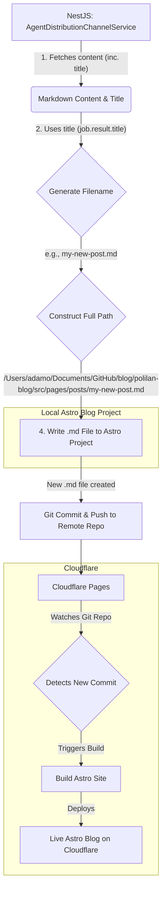

# Plan: Automating Blog Posts from NestJS to Astro & Cloudflare

This document outlines the plan to automate publishing content from the NestJS service (`src/agent-tasks/services/agent-distribution-channel.ts`) to a local Astro blog and subsequently deploy it via Cloudflare.

**Assumptions:**

- The NestJS service retrieves content that includes Markdown text and a title.
- The Astro blog project is located at `/Users/adamo/Documents/GitHub/blog/polilan-blog`.
- New Markdown blog post files in the Astro project should be placed in the `/Users/adamo/Documents/GitHub/blog/polilan-blog/src/pages/posts/` directory.
- The filename for new blog posts will be generated from a `job.result.title` field.

## Phase 1: Automating Local Blog Post Creation

This phase focuses on modifying the NestJS service (`AgentDistributionChannelService`) to create Markdown files directly in the Astro project.

1.  **Content Retrieval (in `AgentDistributionChannelService`):**

    - The `postToBlog` method in `src/agent-tasks/services/agent-distribution-channel.ts` will fetch the job.
    - `job.result.content` will contain the Markdown text.
    - `job.result.title` will contain the title for the blog post.

2.  **Filename Generation (in `AgentDistributionChannelService`):**

    - Logic will be added to create a URL-friendly filename from `job.result.title`.
    - Steps:
      - Convert title to lowercase.
      - Replace spaces and special characters with hyphens.
      - Append the `.md` extension.
      - Example: If `job.result.title` is "My New Blog Post!", the filename becomes `my-new-blog-post.md`.

3.  **File Path Construction (in `AgentDistributionChannelService`):**

    - The service will combine the Astro blog's post directory path with the generated filename:
      - Target path: `/Users/adamo/Documents/GitHub/blog/polilan-blog/src/pages/posts/<generated-filename>.md`

4.  **Markdown File Creation (in `AgentDistributionChannelService`):**
    - The service will use Node.js's built-in `fs` (file system) module to:
      - Write the Markdown content (from `job.result.content`) to the new file at the constructed path.
      - Implement error handling for file writing operations.

## Phase 2: Deployment to Cloudflare (Future Steps)

Once local posting is automated, deploying to Cloudflare will involve these general steps:

1.  **Version Control (Git):**

    - The Astro project (`/Users/adamo/Documents/GitHub/blog/polilan-blog`) must be a Git repository.
    - After the NestJS service creates a new `.md` file, this new file needs to be committed to the Git repository.

2.  **Cloudflare Pages Setup:**

    - Connect the Astro blog's Git repository (e.g., hosted on GitHub, GitLab) to Cloudflare Pages.
    - Cloudflare Pages will be configured to automatically build and deploy the Astro site upon detecting new commits to the repository's main branch.

3.  **Deployment Trigger:**
    - Pushing the commit (containing the new blog post file) to the remote Git repository will trigger Cloudflare to rebuild and deploy the live blog.

## Visual Flow:

## Next Steps for Implementation:

1.  Confirm the exact structure of `job.result` to ensure `title` and `content` fields are correctly accessed.
2.  Implement the filename generation and file writing logic within the `postToBlog` method of `AgentDistributionChannelService` in `src/agent-tasks/services/agent-distribution-channel.ts`.
