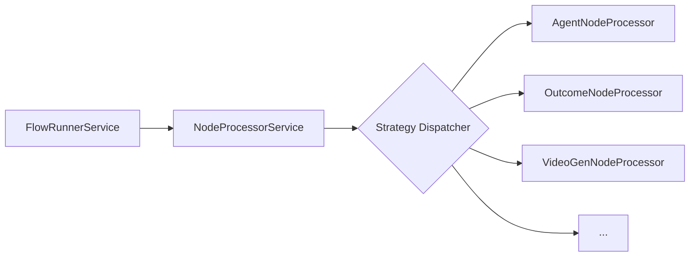

# Node Execution Engine

The Node Execution Engine is the heart of the Control Markets backend. It follows a highly decoupled design using the **Strategy Pattern** to handle the execution of different types of nodes.

## Core Execution Loop

The execution of a flow is handled by the `FlowRunnerService`. When a flow is started:

1.  **State Initialization**: `FlowStateService` transforms the creative-flowboard diagram (nodes and edges) into an `IFlowExecutionState`.
2.  **Task Discovery**: The state identifies "Tasks" (points of interest that require execution, usually Process nodes).
3.  **Job Creation**: For each Task, one or more "Jobs" are created. For example, an `AgentNode` might have a job to generate research content.
4.  **Sequential Execution**: The `FlowRunnerService` iterates through these tasks and jobs sequentially.

## The Strategy Pattern (Node Processors)

The engine itself doesn't know how to generate video or call an LLM. Instead, it delegates this work to **Node Processors**.



### `NodeProcessorService`
This service acts as the central dispatcher. It maintains a registry of all available node processors and, for every job, selects the correct processor based on the `NodeType`.

### `INodeProcessor` Interface
Every backend processor must implement the `INodeProcessor` interface, which defines the `processJob` method:

```typescript
async processJob(
  job: IJobExecutionState, 
  task: ITaskExecutionState, 
  flow: ICreativeFlowBoard
): Promise<Partial<IExecutionResult>>
```

## Key Services Used During Execution

- **`FlowStateService`**: Translates graph architecture into executable steps.
- **`FlowsDbStateService`**: Manages the persistence of flow states in MongoDB.
- **`FlowEventsService`**: Broadcasts real-time events during execution.
- **`PromptBuilderService`**: Used by processors to construct complex AI prompts from dynamic context.
