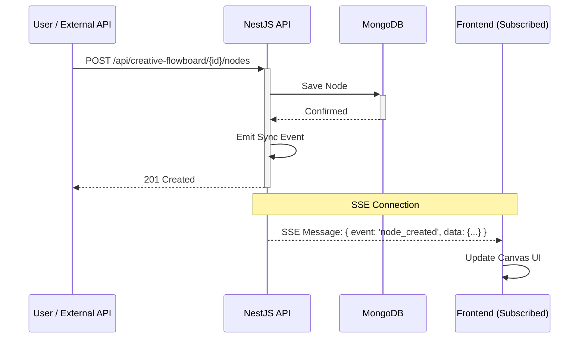

# Real-Time Synchronization

Maintaining a consistent state across the Angular frontend and NestJS backend is critical for a smooth user experience. We use an event-driven synchronization strategy.

## State Types

1.  **Canvas Diagram State**: The structure of the workflow (nodes, edges, positions).
2.  **Execution State**: The real-time status of a running flow (which node is active, job results).

## Synchronization Mechanism: Server-Sent Events (SSE)

We use **Server-Sent Events (SSE)** to push updates from the backend to the frontend. This was chosen for its simplicity and compatibility with our stateless architecture.

### How it Works

1.  **Subscription**: The frontend establishes an SSE connection to `/api/creative-flowboard/subscribe/:flowId`.
2.  **REST Update**: When a user or external system (like n8n) modifies a node or edge, they send a standard REST request to the backend.
3.  **Persistence**: The backend validates and saves the change to MongoDB.
4.  **Broadcast**: Upon a successful save, the `FlowEventsService` emits a synchronization event.
5.  **SSE Push**: The SSE controller picks up the event and pushes it to all clients subscribed to that `flowId`.

## Why SSE instead of WebSockets?

- **Statelessness**: SSE allows us to push updates without maintaining a complex, stateful connection on the server.
- **Efficiency**: SSE is built on standard HTTP and is highly efficient for one-way server-to-client communication.
- **Simplicity**: Easier to implement and debug compared to the bidirectional overhead of WebSockets.
