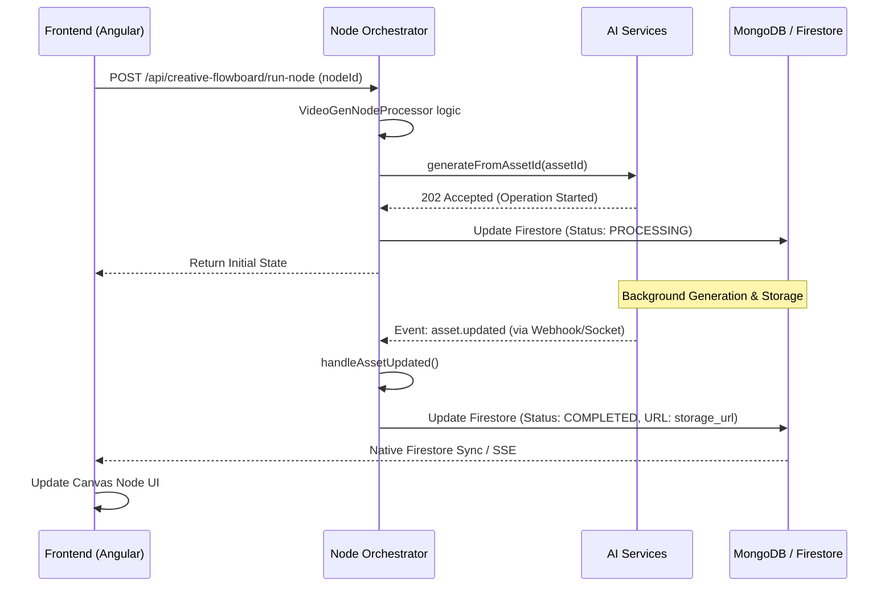

# Video Generation Guide

This document explains the video generation workflow in the Creative Flowboard, covering everything from the frontend request to the backend processing and real-time synchronization.

## Overview

Video generation is an **asynchronous process**. When a user triggers generation (e.g., via a Video Generation Node), the system initiates the request to our AI Services backend and immediately returns a processing state. The final result is synchronized back to the canvas once completed.

---

## 🏗️ Architecture & Flow

The process involves three main layers:
1.  **Frontend (Angular)**: Triggers the execution and listens for real-time updates.
2.  **Orchestrator (NestJS - `control-markets-node`)**: Manages flow logic, node execution, and state persistence.
3.  **AI Services (NestJS - `nest-ai-services`)**: Handles the heavy lifting of communicating with AI providers (Veo, ComfyUI).

### Detailed Workflow

---

## 🚀 Provider Specifics

The system supports multiple providers via the `nest-ai-services` library.

### ComfyUI Flow
Uses an event-driven approach via a socket connection (`comfyui-sdk`).
- **Mechanism**: The backend uploads input images, starts the workflow, and waits for an `onFinished` event.
- **Result**: The video is downloaded from the ComfyUI server, uploaded to permanent storage (S3/R2), and the asset is marked as complete.

### Veo (Vertex AI) Flow
Uses Google's Long-Running Operations (LRO).
- **Mechanism**: Initiates a generation task and receives an `operationId`. The system polls for status in the background.
- **Result**: Once finished, the video is retrieved and stored permanently.

---

## 🔄 State Synchronization

Keeping the UI in sync with the background process is critical. We use two main mechanisms:

### 1. Execution State (Firestore)
The `CreativeFlowboardService` maintains the flow's execution status in **Firestore** (`flows_execution_state`). 
- When a node starts processing, its job status is updated to `PROCESSING`.
- When the `asset.updated` event is received by `VideoGenNodeProcessor`, it updates the Firestore document.
- The Angular frontend subscribes to this Firestore document for real-time UI updates (progress bars, status indicators).

### 2. Canvas Synchronization (SSE)
For changes to the canvas structure itself (adding/removing nodes), the system uses **Server-Sent Events (SSE)**.
- Endpoint: `GET /api/creative-flowboard/subscribe/:id`
- Event Type: `SYNC_CANVAS`

---

## 🛠️ Implementation Details (Backend)

The primary class responsible for video orchestration is **`VideoGenNodeProcessor`**:

- **`processJob()`**: Called when the flow runner reaches a video node. It creates a `GeneratedAsset` entry and calls the AI Service client.
- **`handleAssetUpdated()`**: A listener for the `@OnEvent('asset.updated')` event. This is triggered when the AI Service library finishes a generation task (via internal webhooks or sockets). It finalizes the job state and updates the database.

---

## 💡 Suggestions for Improvement

Based on the current architecture, here are some recommended enhancements:

1.  **Unified Progress Reporting**: Implement a standardized `progress` field in the `GeneratedAsset` entity so the frontend can display a real-time percentage (0-100%) instead of just a generic "Processing" state.
2.  **Shared Storage Service**: Consolidate storage logic (S3/Google/R2) into a single service used across both provider implementations to reduce code duplication in the AI library.
3.  **Webhook Reliability**: Implement retry logic for webhooks and `asset.updated` events to handle transient network issues or service downtime.
4.  **Client-Side Optimistic UI**: Show the "Processing" state on the frontend immediately before the backend even responds to the initial request, improving perceived performance.
5.  **Unified Provider Interface**: Abstract Comfy and Veo behind a common `VideoProvider` interface in the AI library to ensure consistent behavior for polling and terminal statuses.
