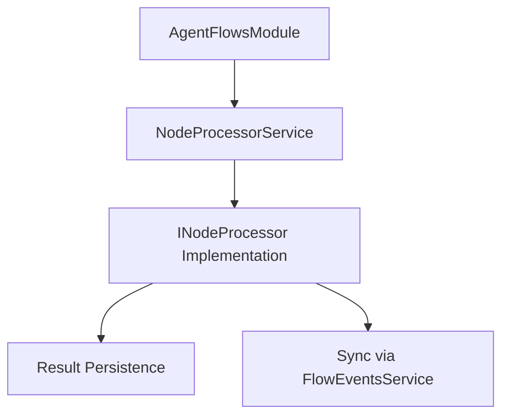

# Node Library Reference

The Control Markets backend is designed as a modular library of node processors. This reference guide outlines the technical specifications for implementing and integrating these processors.

## `INodeProcessor` Interface

All processors must implement the `INodeProcessor` interface located in `src/agent-flows/services/node-processors/inode.processor.ts`.

### `processJob` Method

```typescript
async processJob(
  job: IJobExecutionState, 
  task: ITaskExecutionState, 
  flow: ICreativeFlowBoard
): Promise<Partial<IExecutionResult>>
```

**Parameters:**
- `job`: The current job's execution state, including input/process/output node IDs and current status.
- `task`: The parent task state that contains multiple jobs.
- `flow`: The complete flow diagram (nodes and edges) for context.

**Returns:**
A `Promise` that resolves to a partial `IExecutionResult`, typically containing:
- `status`: One of `StatusJob.COMPLETED` or `StatusJob.FAILED`.
- `statusDescription`: A human-readable description of the result or error.
- `outputEntityId`: The MongoDB ID of the generated data (if applicable).

## Core Data Models

The following enums and interfaces are central to the backend's operation:

### `NodeType`
Defines the class of node being processed. Key types include:
- `AgentNodeComponent`
- `OutcomeNodeComponent`
- `AssetsNodeComponent`

### `StatusJob`
- `PENDING`: Initial state.
- `IN_PROGRESS`: Currently executing.
- `COMPLETED`: Success.
- `FAILED`: Error occurred.

## Utility Services for Processors

Processors are encouraged to use these shared services:

- **`LlmService`**: Low-level communication with AI models.
- **`PromptBuilderService`**: Constructing complex, context-aware prompts.
- **`AgentOutcomeJobService`**: Creating and managing the record of generated outcomes.

## Technical Architecture Diagram


