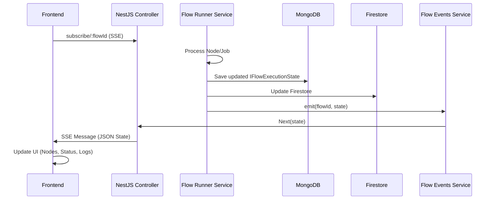

# Execution State

The **Execution State** is a central concept in the Control Markets platform. it represents the real-time status and data of a flow (or a single node) as it is being processed by the [Node Execution Engine](file:///Users/adamo/Documents/GitHub/control-markets-node/docs/technical-reference/node-execution-engine.md).

## Core Concepts

Whenever a user triggers an execution (either by running a whole flow or a single node), a new `FlowExecutionState` object is created. This object serves as the **source of truth** for that specific execution instance.

### Data Structure

The execution state is defined by the `IFlowExecutionState` interface:

*   **`flowExecutionId`**: A unique identifier for this specific execution run.
*   **`status`**: The overall progress (`PENDING`, `IN_PROGRESS`, `COMPLETED`, `FAILED`).
*   **`tasks`**: An array of `ITaskExecutionState` objects, each representing a "cluster" of work (usually centered around a Process node).
    *   **`jobs`**: An array of `IJobExecutionState` objects within a task, representing the granular steps performed by [Node Processors](file:///Users/adamo/Documents/GitHub/control-markets-node/docs/technical-reference/node-execution-engine.md#the-strategy-pattern-node-processors).

## Persistence

The execution state is persisted in two places to balance reliability and real-time accessibility:

1.  **MongoDB (`flow_execution_states` collection)**: This is the primary **Source of Truth**. Every update to the execution state is saved here via the `FlowExecutionStateService`.
2.  **Firestore**: The state is also replicated to Google Cloud Firestore,  This will be deprecated in the future.  This provides an easy way for secondary systems or different views to access the latest state without putting load on the primary database during high-frequency updates.

## Synchronization and Real-time Updates

Real-time feedback in the UI is achieved through a combination of database persistence and **Server-Sent Events (SSE)**.

### The Synchronization Flow

1.  **Subscription**: The frontend establishes an SSE connection to `/api/creative-flowboard/subscribe/:id`.
2.  **Execution Phase**: As the `FlowRunnerService` iterates through tasks and jobs, it updates the `IFlowExecutionState` object after every significant step (e.g., job started, job completed, job failed).
3.  **Broadcast**: Each update calls `updateExecutionState`, which:
    *   Saves to MongoDB.
    *   Updates Firestore.
    *   Emits an event through `FlowEventsService`.
4.  **UI Update**: The SSE connection pushes the updated state to the frontend, which immediately reflects the changes (status spinners, checkmarks, result previews, or error messages).

## Error Handling and Descriptions

When an execution fails, it is critical that the user understands *why*.

*   **Processor Failures**: Node processors are responsible for catching errors during their internal logic (e.g., LLM failures, API timeouts).
*   **Status Description**: Processors return a `statusDescription` containing the error details.
*   **Propagation**: The `FlowRunnerService` captures this description and assigns it to the `job.statusDescription`.
*   **Visibility**: This description is saved in the DB and sent via SSE, allowing the frontend to display accurate error messages next to the failing node.

> [!NOTE]
> Each execution (Run Flow or Run Node) generates a **new** `flowExecutionId`, ensuring that history is preserved and subsequent runs don't overwrite each other's results.
