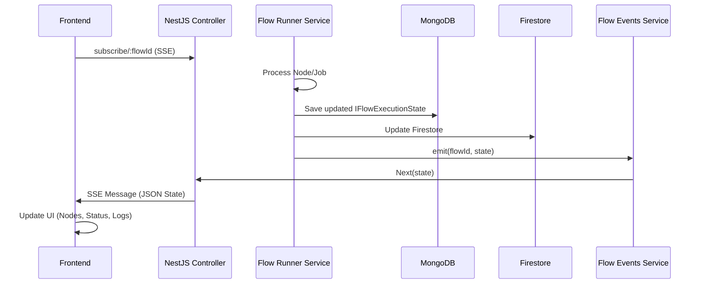

# Execution State

The **Execution State** is a central concept in the Control Markets platform. it represents the real-time status and data of a flow (or a single node) as it is being processed by the [Node Execution Engine](file:///Users/adamo/Documents/GitHub/control-markets-node/docs/technical-reference/node-execution-engine.md).

## Core Concepts

Whenever a user triggers an execution (either by running a whole flow or a single node), a new `FlowExecutionState` object is created. This object serves as the **source of truth** for that specific execution instance.

## Hierarchy: Flow -> Task -> Job

The execution state follows a three-level hierarchy to manage complexity:

1.  **Flow Execution (`IFlowExecutionState`)**: Represents the entire run of a blackboard or a specific node.
2.  **Task (`ITaskExecutionState`)**: Represents a "Process" node in the flow (e.g., an `CompletionNodeComponent`). A single flow execution can contain multiple tasks if multiple process nodes are being run.
3.  **Job (`IJobExecutionState`)**: Represents the granular unit of work. Usually, every "Input" node connected to a "Process" node results in a **Job**.
    *   **Standalone Tasks**: If a `TaskNodeComponent` has no input nodes connected, it creates a single Job for itself.
    *   **Consolidated Jobs (Multi-Resource)**: For nodes like `VideoGenNodeComponent`, the engine can consolidate multiple inputs (e.g., Image + Audio) into a **single Job** using the `inputNodeIds` array. This prevents redundant processing when multiple sources are required for a single generation.

### Data Model Relations

*   A `FlowExecutionState` has an array of `tasks`.
*   Each `Task` has an array of `jobs`.
*   When all `jobs` in a `Task` are `COMPLETED`, the `Task` status is updated.
*   When all `tasks` in a `Flow` are `COMPLETED`, the overall `Flow` status is updated.

### State Initialization (`createInitialState`)

The `FlowStateService.createInitialState` method is responsible for transforming the visual graph into this structured execution state:

1.  **Identity**: Generates a unique `flowExecutionId`.
2.  **Task Discovery**: Filters the flow's nodes for those with `category: 'process'`. These are converted into `ITaskExecutionState`.
3.  **Job Assignment**: For each process node, it looks for connected **Input Nodes** (excluding `SourcesNodeComponent` which only provide static data).
    *   **Standalone Tasks**: If a `TaskNodeComponent` has no valid input nodes connected, the engine creates a "self-referencing" job for that Task, allowing it to execute using only the task's prompt.
4.  **Job Creation**: For each valid input node, an `IJobExecutionState` is created. It maps:
    *   `inputNodeId`: The primary source of data.
    *   `inputNodeIds`: (Optional) Array of all input node IDs for consolidated jobs (e.g., multi-resource video).
    *   `processNodeId`: The node performing the action.
    *   `nodeType`: The "Official Type" of the **Input Node**.
    *   `processNodeType`: The "Official Type" of the **Process Node**.
    *   `outputNodeId`: The node where the result will be displayed.

> [!CAUTION]
> **Never use `node.type` for logic**: Always prefer `node.config.component`. The `node.type` field may contain structural wrapper types that do not correspond to the actual business logic of the node.

## Persistence

The execution state is persisted in two places to balance reliability and real-time accessibility:

1.  **MongoDB (`flow_execution_states` collection)**: This is the primary **Source of Truth**. Every update to the execution state is saved here via the `FlowExecutionStateService`.
2.  **Firestore**: The state is also replicated to Google Cloud Firestore,  This will be deprecated in the future.  This provides an easy way for secondary systems or different views to access the latest state without putting load on the primary database during high-frequency updates.

## Synchronization and Real-time Updates

Real-time feedback in the UI is achieved through a combination of database persistence and **Server-Sent Events (SSE)**.

### The Synchronization Flow

1.  **Subscription**: The frontend establishes an SSE connection to `/api/creative-flowboard/subscribe/:id`.
2.  **Execution Phase**: As the `FlowRunnerService` iterates through tasks and jobs, it updates the `IFlowExecutionState` object after every significant step (e.g., job started, job completed, job failed).
3.  **Broadcast**: Each update calls `updateExecutionState`, which:
    *   Saves to MongoDB.
    *   Updates Firestore.
    *   Emits an event through `FlowEventsService`.
4.  **UI Update**: The SSE connection pushes the updated state to the frontend, which immediately reflects the changes (status spinners, checkmarks, result previews, or error messages).

## Error Handling and Descriptions

When an execution fails, it is critical that the user understands *why*.

*   **Processor Failures**: Node processors are responsible for catching errors during their internal logic (e.g., LLM failures, API timeouts).
*   **Status Description**: Processors return a `statusDescription` containing the error details.
*   **Propagation**: The `FlowRunnerService` captures this description and assigns it to the `job.statusDescription`.
*   **Visibility**: This description is saved in the DB and sent via SSE, allowing the frontend to display accurate error messages next to the failing node.

> [!NOTE]
> Each execution (Run Flow or Run Node) generates a **new** `flowExecutionId`, ensuring that history is preserved and subsequent runs don't overwrite each other's results.
