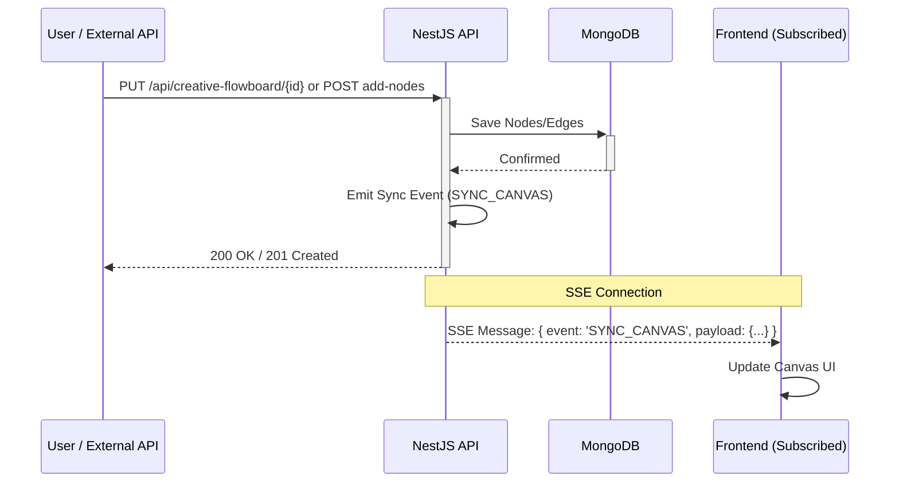

# Real-Time Synchronization

Maintaining a consistent state across the Angular frontend and NestJS backend is critical for a smooth user experience. We use an event-driven synchronization strategy, covering both **canvas sync** (nodes/edges added or saved) and **execution updates** (job status while a flow runs).

## State Types

1.  **Canvas Diagram State**: The structure of the workflow (nodes, edges, positions).
2.  **Execution State**: The real-time status of a running flow (which node is active, job results).

## Synchronization Mechanism: Server-Sent Events (SSE)

We use **Server-Sent Events (SSE)** to push updates from the backend to the frontend. This was chosen for its simplicity and compatibility with our stateless architecture. A single SSE channel per flow carries two types of events:

| Event | Trigger | Effect on frontend |
|---|---|---|
| `SYNC_CANVAS` | Any canvas save or node mutation | Deserializes and replaces canvas state |
| `EXECUTION_UPDATE` | Job/task status change during flow run | Updates execution state panel |

### How it Works

1.  **Subscription**: The frontend establishes an SSE connection to `/api/creative-flowboard/subscribe/:flowId`. Each client connecting to a flow opens this endpoint. The connection is kept alive until the client disconnects or navigates away.
2.  **REST Update**: When a user or external system (like n8n) modifies a node or edge, they send a standard REST request to the backend.
3.  **Persistence**: The backend validates and saves the change to MongoDB.
4.  **Broadcast**: Upon a successful save, the `FlowEventsService` emits a synchronization event (`SYNC_CANVAS`).
5.  **SSE Push**: The SSE controller picks up the event and pushes it to all clients subscribed to that `flowId`.



## Why SSE instead of WebSockets?

- **Statelessness**: SSE allows us to push updates without maintaining a complex, stateful connection on the server.
- **Efficiency**: SSE is built on standard HTTP and is highly efficient for one-way server-to-client communication.
- **Simplicity**: Easier to implement and debug compared to the bidirectional overhead of WebSockets.

---

## Architecture Overview

```text
┌─────────────┐   PUT /:id / POST add-nodes   ┌──────────────────────┐
│  Client A   │ ────────────────────────────► │   NestJS Backend     │
│  (editor)   │                               │                      │
└─────────────┘                               │  1. Save to MongoDB  │
                                              │  2. Emit SYNC_CANVAS │
┌─────────────┐   SSE ◄───────────────────────┤     via EventEmitter │
│  Client A   │   (own save reflected back)   └──────────────────────┘
│  Client B   │ ◄─────────────────────────── SSE push to all
│  Client C   │   SYNC_CANVAS { nodes, edges }   subscribers
└─────────────┘
```

## Backend

### SSE Endpoint

**File:** `control-markets-node/src/creative-flowboard/controllers/creative-flowboard.controller.ts`

```typescript
@Sse('subscribe/:id')
subscribe(@Param('id') id: string): Observable<MessageEvent> {
  return new Observable(observer => {
    const handler = data => observer.next({ data });
    this.flowEventsService.subscribe(id, handler);
    return () => this.flowEventsService.unsubscribe(id, handler);
  });
}
```

### FlowEventsService (Node)

**File:** `control-markets-node/src/creative-flowboard/services/flow-events.service.ts`

A singleton service wrapping Node's `EventEmitter`. Each flow has its own channel keyed by `flowId`.

```typescript
emit(flowId: string, data: any)       // broadcast to all subscribers
subscribe(flowId, handler)            // called when SSE client connects
unsubscribe(flowId, handler)          // called when SSE client disconnects
```

> **Scaling note:** `EventEmitter` is in-process only. If you run multiple NestJS instances, upgrade to Redis Pub/Sub as described in `control-markets-node/docs/plans/new_realtime_architecture.md`.

### Emit Points

Two operations on the backend emit `SYNC_CANVAS`:

| Operation | Where | Payload |
|---|---|---|
| Full canvas save | `PUT /api/creative-flowboard/:id` → `saveCanvas()` | Full updated flow document |
| Add nodes/edges | `POST /api/creative-flowboard/add-nodes` → `addNodes()` | Full updated flow document |

Both methods use the same pattern:
1. Persist to MongoDB
2. `this.flowEventsService.emit(flowId, { event: 'SYNC_CANVAS', payload: result })`

---

## Frontend (Angular)

### FlowEventsService

**File:** `control-markets-angular/src/app/pages/flows/services/flow-events.service.ts`

Manages the `EventSource` connection and routes incoming events to the appropriate state service.

```typescript
subscribeToFlow(flowId: string): Observable<IFlowEvent>
disconnect(): void
```

**Event routing:**

```typescript
switch (event.event) {
  case 'SYNC_CANVAS':     → handleSyncCanvas(payload)
  case 'EXECUTION_UPDATE' → handleExecutionUpdate(payload)
}
```

### handleSyncCanvas

When a `SYNC_CANVAS` event arrives:

1. **If canvas is clean** (`isDirty() === false`): calls `FlowSerializationService.deserializeFlow(payload)` — nodes and edges are rebuilt from the incoming data and signals update automatically.
2. **If canvas has unsaved changes** (`isDirty() === true`): shows a warning toast instead of overwriting:
   > *"Another user saved this flow. Save or discard your changes to see the latest version."*

### Subscription Lifecycle

| Moment | Action |
|---|---|
| Flow page loads (`loadInitialFlow`) | `subscribeToFlow(flowId)` — always, not just during execution |
| User clicks Run Flow | `disconnect()` then `subscribeToFlow(flowId)` — reconnect for execution events |
| User navigates away (`ngOnDestroy`) | `disconnect()` — closes the `EventSource` cleanly |

**File:** `control-markets-angular/src/app/pages/flows/services/flow-orchestration.service.ts`

---

## Complete Flow: Two Users Editing

```text
User A opens flow/abc   →  SSE subscribe → channel: "abc"
User B opens flow/abc   →  SSE subscribe → channel: "abc"

User B adds a node and saves
  → PUT /api/creative-flowboard/abc
  → MongoDB updated
  → emit("abc", { event: "SYNC_CANVAS", payload: updatedFlow })

SSE server pushes to User A and User B

User A (clean canvas)
  → handleSyncCanvas(payload)
  → deserializeFlow() → canvas reflects new node instantly

User B (their own save reflected back)
  → isDirty() === false (markClean() was called on save)
  → deserializeFlow() → no-op effect (same state)
```

---

## Complete Flow: External API Insert

Any HTTP client (n8n, scripts, direct API calls) can insert nodes:

```text
POST /api/creative-flowboard/add-nodes
Body: { flowId: "abc", nodes: [...], edges: [...] }

→ MongoDB $push nodes/edges
→ emit("abc", { event: "SYNC_CANVAS", payload: updatedFlow })
→ All open browsers on flow/abc update automatically
```

---

## Event Payload Shape

```typescript
interface IFlowEvent {
  event: 'SYNC_CANVAS' | 'EXECUTION_UPDATE' | 'LOG_STREAM';
  payload: any;
}

// SYNC_CANVAS payload — full CreativeFlowBoard document
{
  event: 'SYNC_CANVAS',
  payload: {
    id: string,
    name: string,
    nodes: IFlowNode[],
    edges: IFlowEdge[],
    metadata: { ... }
  }
}
```

---

## Files Involved

| File | Role |
|---|---|
| `control-markets-node/src/creative-flowboard/controllers/creative-flowboard.controller.ts` | SSE endpoint + PUT override that emits after save |
| `control-markets-node/src/creative-flowboard/services/flow-events.service.ts` | EventEmitter hub |
| `control-markets-node/src/creative-flowboard/services/creative-flowboard.service.ts` | `saveCanvas()` and `addNodes()` — the two emit points |
| `control-markets-angular/src/app/pages/flows/services/flow-events.service.ts` | SSE client, event routing, canvas apply logic |
| `control-markets-angular/src/app/pages/flows/services/flow-orchestration.service.ts` | Subscribe on load, disconnect on leave |
| `control-markets-angular/src/app/pages/flows/flow-workspace/creative-flowboard-canva.ts` | `ngOnDestroy` disconnect |
| `control-markets-angular/src/app/pages/flows/services/flow-serialization.service.ts` | `deserializeFlow()` — rebuilds canvas signals from plain data |
