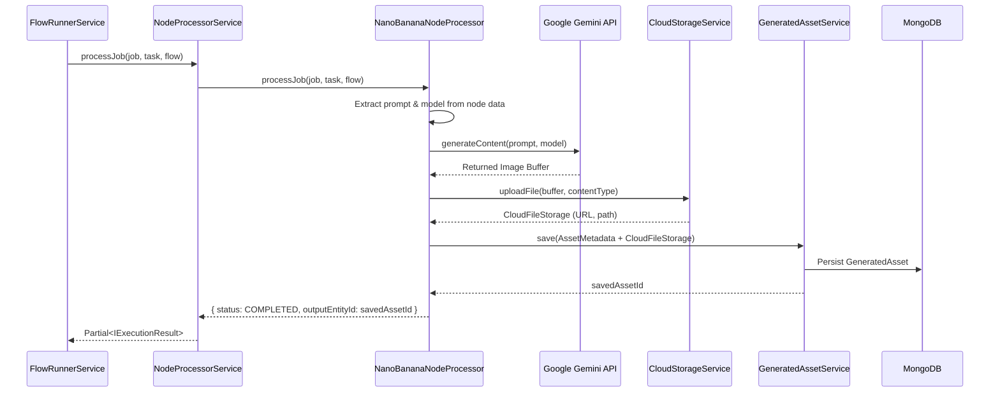

# Nano Banana Integration Flow

This document details the technical implementation and execution flow for the **Nano Banana** (Gemini Image Generation) component within the Creative Flowboard.

## Architecture Overview

The Nano Banana integration follows the Strategy Pattern used by the Node Execution Engine. It introduces a dedicated processor that handles the complex interaction between flow nodes, external AI APIs, and cloud storage.

### Sequence Flow

## Key Components

### 1. NanoBananaNodeProcessor
Located at: [nanobanana-node.processor.ts](file:///Users/adamo/Documents/GitHub/control-markets-node/src/creative-flowboard/services/node-processors/nanobanana-node.processor.ts)

This is the core logic handler. It performs the following steps:
- **Environment Setup**: Initializes the `@google/genai` SDK using `GEMINI_API_KEY` from the `ConfigService`.
- **Data Extraction**: Looks up the process node in the flow to retrieve user-defined parameters:
    - `prompt`: The textual description for the image.
    - `model`: Choice between `gemini-2.5-flash-image` (Fast) or `gemini-3-pro-image-preview` (High Fidelity).
- **Gemini API Call**: Dispatches the generation request.
- **Storage Integration**: Streams the resulting binary buffer to **Google Cloud Storage** via `CloudStorageService`.
- **Asset Persistence**: Creates a record in the `generated_assets` collection, allowing the UI to track and display the result.

### 2. NodeProcessorService Routing
Located at: [node-processor.service.ts](file:///Users/adamo/Documents/GitHub/control-markets-node/src/creative-flowboard/services/node-processor.service.ts)

The `NodeProcessorService` recognizes the `NanoBananaNodeComponent` type and routes the execution to the new processor. It includes a specific check for flows where an **AssetsNode** (Input) is connected to a **Nano Banana** (Process) node, enabling future "image-to-image" capabilities.

## Data Structure

The output of a Nano Banana job is a `generatedAsset`. The `IJobExecutionState` is updated as follows:
- `status`: Switched to `COMPLETED`.
- `outputEntityId`: Set to the `_id` of the new `GeneratedAsset`.
- `resultType`: Set to `'generatedAsset'`.

## Verification
A standalone script exists to dry-run this flow: [test-nanobanana.ts](file:///Users/adamo/Documents/GitHub/control-markets-node/src/creative-flowboard/scripts/test-nanobanana.ts).
