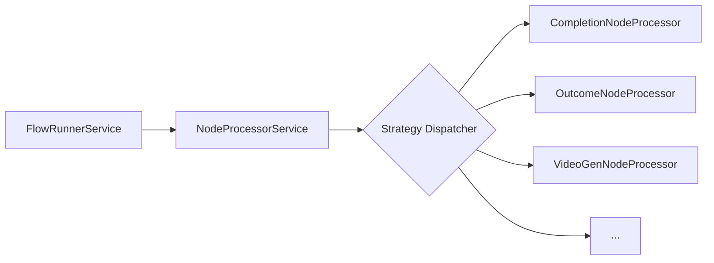

# Node Execution Engine

The Node Execution Engine is the heart of the Control Markets backend. It follows a highly decoupled design using the **Strategy Pattern** to handle the execution of different types of nodes.

## Core Execution Loop

The execution of a flow is handled by the `FlowRunnerService`. The orchestration follows a hierarchical approach:

1.  **State Initialization**: `FlowStateService` transforms the visual diagram into an `IFlowExecutionState`. This process identifies **Tasks** (from Process nodes) and **Jobs** (usually from Input nodes connected to those Process nodes, or from the Task itself if no input is present).
2.  **Task Iteration**: The `FlowRunnerService` iterates through the `tasks` in the execution state.
3.  **Job Processing**: For each Task, the runner iterates through its `jobs`. 
4.  **Sequential Execution**:
    *   Jobs within a Task are processed sequentially.
    *   Each job is dispatched to its corresponding **Node Processor**.
    *   The Task status is only updated to `COMPLETED` once all its constituent Jobs are finished.
5.  **State Updates**: After each job completes (or fails), the `FlowExecutionState` is updated and broadcasted to the UI via SSE.

## The Strategy Pattern (Node Processors)

The engine itself doesn't know how to generate video or call an LLM. Instead, it delegates this work to **Node Processors**.



### `NodeProcessorService`
This service acts as the central dispatcher. It maintains a registry of all available node processors and, for every job, selects the correct processor based on the `NodeType`.

### `INodeProcessor` Interface
Every backend processor must implement the `INodeProcessor` interface, which defines the `processJob` method:

```typescript
async processJob(
  job: IJobExecutionState, 
  task: ITaskExecutionState, 
  flow: ICreativeFlowBoard
): Promise<Partial<IExecutionResult>>
```

## Key Services Used During Execution

- **`FlowStateService`**: Translates graph architecture into executable steps.
- **`FlowsDbStateService`**: Manages the persistence of flow states in MongoDB.
- **`FlowEventsService`**: Broadcasts real-time events during execution.
- **`PromptBuilderService`**: Used by processors to construct complex AI prompts from dynamic context.
