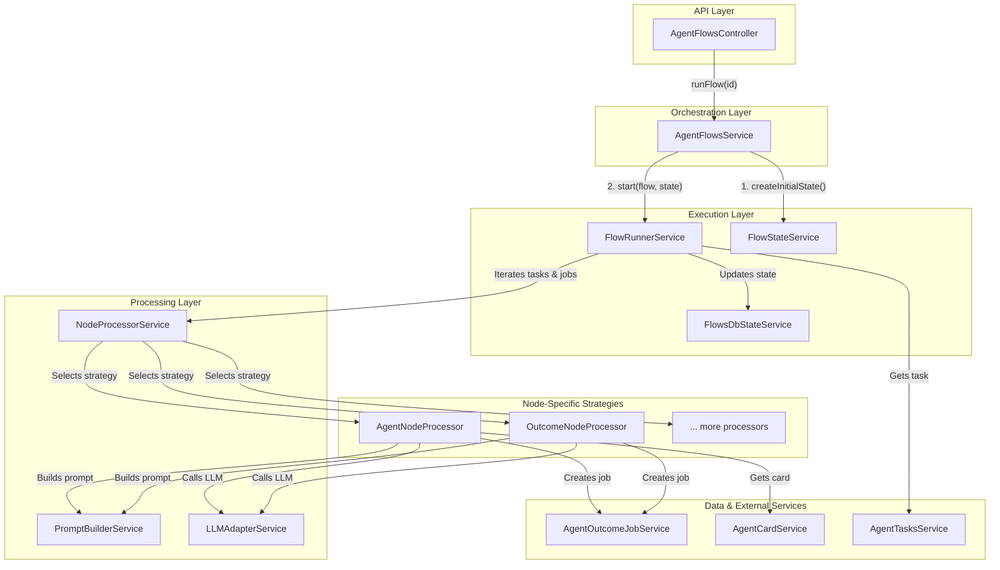

# Agent Flows: System Architecture

This document outlines the refactored architecture of the Agent Flows system. The primary goal of this refactoring was to improve modularity, maintainability, and extensibility by applying the Single Responsibility Principle and the Strategy design pattern.

## High-Level Overview

The original monolithic `AgentFlowsService` has been decomposed into a set of smaller, specialized services that work together to execute a flow. The new architecture is layered, with clear separation of concerns between orchestration, state management, execution, and job processing.

## Architecture Diagram

The following diagram illustrates the flow of control and the interaction between the new services:

## Core Services and Responsibilities

### 1. `AgentFlowsService` (The Orchestrator)
- **File:** `agent-flows.service.ts`
- **Responsibility:** Acts as the public-facing entry point for initiating a flow. Its role is now limited to high-level orchestration. It coordinates between the `FlowStateService` to build the initial state and the `FlowRunnerService` to start the execution.

### 2. `FlowStateService` (The State Manager)
- **File:** `flow-state.service.ts`
- **Responsibility:** Manages the creation and initialization of the `IFlowExecutionState` object. It encapsulates all the logic for interpreting the flow's structure (`nodes` and `edges`) and building the initial state for a run, including all tasks and their associated jobs.

### 3. `FlowRunnerService` (The Executor)
- **File:** `flow-runner.service.ts`
- **Responsibility:** Manages the core execution loop of a flow. It iterates through the tasks and jobs defined in the `IFlowExecutionState`, updates their status, and delegates the actual processing of each job to the `NodeProcessorService`.

### 4. `NodeProcessorService` (The Job Processor / Strategy Dispatcher)
- **File:** `node-processor.service.ts`
- **Responsibility:** Implements the **Strategy design pattern**. It acts as a factory that selects and executes the appropriate node-processing strategy based on the `NodeType` of the current job. This service is the key to the system's extensibility.

### 5. `PromptBuilderService` (The Prompt Engineer)
- **File:** `prompt-builder.service.ts`
- **Responsibility:** Centralizes all logic related to constructing prompts for the Large Language Model (LLM). It handles the complexities of building conversation history, injecting context from sources, and formatting the final prompt according to the task's requirements.

### 6. Node Processors (The Strategies)
- **Directory:** `node-processors/`
- **Responsibility:** Each file in this directory is a concrete implementation of the `INodeProcessor` interface and contains the specific logic for handling one type of node.
  - **`agent-node.processor.ts`**: Handles jobs for `AgentNodeComponent`.
  - **`outcome-node.processor.ts`**: Handles jobs for `OutcomeNodeComponent`.

## How to Extend the System

Adding support for a new node type is now a straightforward process that minimizes changes to existing code:

1.  **Create a New Processor:** Create a new class in the `src/agent-flows/services/node-processors/` directory (e.g., `new-node.processor.ts`).
2.  **Implement the Interface:** The new class must implement the `INodeProcessor` interface, which requires a `process()` method.
3.  **Add to the Module:** Register the new processor class in the `providers` array of the `agent-flows.module.ts` file.
4.  **Register the Strategy:** In the `NodeProcessorService` constructor, inject the new processor and register it in the `processors` map with its corresponding `NodeType`.

Once these steps are completed, the `FlowRunnerService` will be able to process jobs for the new node type automatically, without requiring any modifications to the core execution logic.