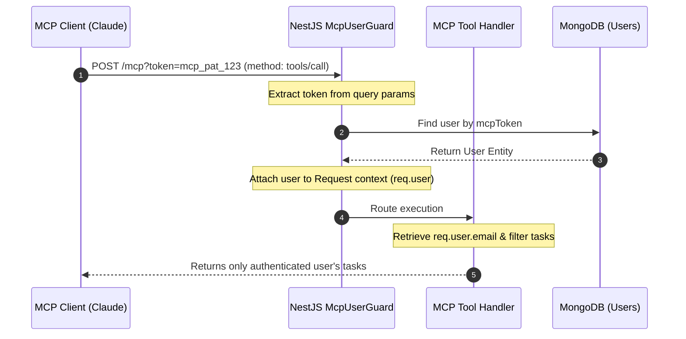
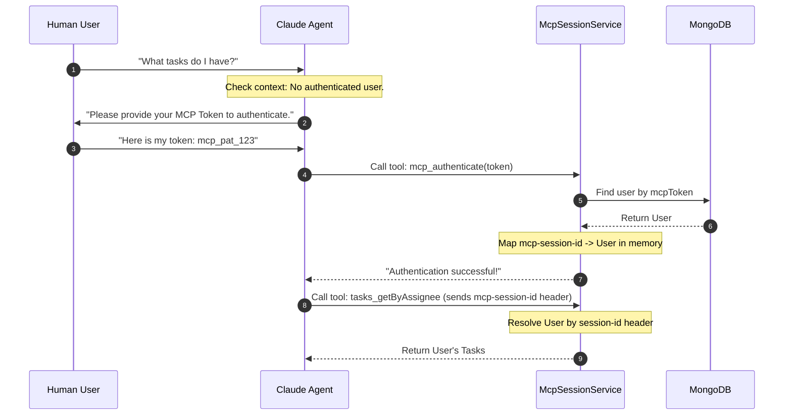

# Architectural Decision Record (ADR): MCP User Security & Identification Layer

This document outlines the design and implementation options for adding a security and user identification layer to the Control Markets Model Context Protocol (MCP) server.

---

## 1. Context & Problem Statement

Currently, the Control Markets platform exposes an HTTP-based MCP server (`POST /mcp`) running inside the NestJS instance on port `8121`. 
AI clients (such as Claude Code, Claude Desktop, or Cursor) connect to this endpoint to interact with flowboards, user directories, and agent tasks.

However, the current implementation has two major security and usability gaps:
1. **Lack of User Distinction:** The MCP server executes operations without knowing which human user is initiating them.
2. **Spoofing Risks:** Tools like `tasks_getByAssignee` require parameters like `email`, `userId`, or `name`. Because there is no authorization, the agent can request data on behalf of any user, or spoof parameters to access restricted tasks.
3. **Friction in Context-Aware Queries:** If a user asks *"What tasks do I have available?"*, the agent has no way of knowing the user's identity automatically. It must ask the user *"What is your email or user ID?"*, which introduces friction and allows the user to lie.

We need a lightweight, simple-to-implement first version that secures user scopes, prevents spoofing, and enables seamless context-aware queries.

---

## 2. Options Analysis

We analyzed four architectural options for verifying user identity, ranging from simple local tokens to full OAuth 2.0.

### Option 1: URL Query Parameter Token (Frictionless & Recommended)
The user registers the MCP server URL with a personal access token appended as a query parameter (e.g. `http://localhost:8121/mcp?token=USER_MCP_TOKEN`).



* **Pros:**
  * **Zero Chat Friction:** The user never has to log in or enter keys inside the chat window. Once configured, it "just works."
  * **No Client CLI Customization Needed:** Every standard HTTP MCP client supports query parameters in the base URL.
  * **Standard NestJS Guard Integration:** Fits directly into NestJS request lifecycle.
* **Cons:**
  * The token is stored in the client-side configuration file in cleartext (standard for local API keys).
  * URL query parameters can sometimes be logged by reverse proxies (mitigated by local network operation).

### Option 2: Stateful Session Handshake (Interactive Chat Login)
The MCP client registers using the standard unauthenticated URL. The server exposes an authentication tool (e.g., `mcp_authenticate(token: string)`).



* **Pros:**
  * **Clean URLs:** No need to configure query parameters in the client installation.
  * **Session Isolation:** Authentications are bound to the specific `mcp-session-id` lifecycle.
* **Cons:**
  * **High Chat Friction:** The user must enter their token in the chat once for every new CLI/Agent session.
  * Requires an in-memory session mapping table (`Map<string, UserEntity>`) managed on the server.

### Option 3: Full OAuth 2.0 Authorization Flow (Strict Compliance)
Leverage the built-in OAuth features of `@rekog/mcp-nest` (`McpAuthJwtGuard`, `/authorize`, `/token` endpoints) which prompt the IDE/client to initiate a browser login.
* **Pros:**
  * **Maximum Security:** Standard OAuth 2.0 authorization code flow with expiration and refresh tokens.
  * **No Key Handling:** The user logs in via the standard web interface.
* **Cons:**
  * High implementation and configuration complexity for a first version.
  * Not all MCP clients (especially CLI-based tools like early Claude Code versions) have stable support for initiating interactive OAuth flows.

### Option 4: Basic Self-Reporting (Zero Security)
The agent asks the user *"What is your email?"* and accepts whatever they answer, passing it to `tasks_getByAssignee({ email })`.
* **Pros:**
  * Zero code changes required on the server.
* **Cons:**
  * **No Security:** Any user can type another user's email to access their data.
  * Friction remains as the user has to self-identify on new chats.

---

## 3. Decision

We will implement **Option 1: URL Query Parameter Token** as the primary security layer, supplemented with a custom NestJS Guard. 

This provides the best trade-off for a first version: it is **spoof-proof**, completely **frictionless in the chat**, and requires minimal architectural changes.

---

## 4. Implementation Step-by-Step

### Step 1: Update the User Schema
Add an `mcpToken` field to the `UserEntity` to store the personal access token.

```typescript
// src/user/user.entity.ts
@Schema({ collection: 'users' })
export class UserEntity extends Document implements IUser {
  // ... existing fields ...

  @Prop({ type: mongoose.Schema.Types.String, required: false, unique: true, sparse: true })
  mcpToken?: string;
}
```

Add a quick query lookup helper to `AppUserService`:

```typescript
// src/user/user.service.ts
async findUserByMcpToken(token: string): Promise<UserEntity | null> {
  return this.userModel.findOne({ mcpToken: token }).exec();
}
```

### Step 2: Implement the MCP User Identification Guard
Create a new guard `mcp-user.guard.ts` inside `src/mcp/` that extracts the token and populates `request.user`.

```typescript
// src/mcp/mcp-user.guard.ts
import { CanActivate, ExecutionContext, Injectable } from '@nestjs/common';
import { AppUserService } from '../user/user.service';

@Injectable()
export class McpUserIdentificationGuard implements CanActivate {
  constructor(private readonly userService: AppUserService) {}

  async canActivate(context: ExecutionContext): Promise<boolean> {
    const request = context.switchToHttp().getRequest();
    
    // 1. Try to extract token from query parameters (?token=xxx)
    let token = request.query?.token;
    
    // 2. Fall back to Authorization Header (Bearer xxx)
    if (!token && request.headers.authorization) {
      const parts = request.headers.authorization.split(' ');
      if (parts[0] === 'Bearer') {
        token = parts[1];
      }
    }

    if (token) {
      try {
        const user = await this.userService.findUserByMcpToken(token);
        if (user) {
          // Inject user entity into request so it's accessible inside MCP tools
          request.user = user;
        }
      } catch (error) {
        // Log error silently, fail closed/unauthenticated rather than crashing
        console.error('Error verifying MCP Token:', error);
      }
    }

    // We return true to allow unauthenticated connections, but protected tools
    // will check for request.user and reject unauthenticated requests individually.
    return true;
  }
}
```

### Step 3: Register the Guard in McpModule
Modify `app.module.ts` to include the `McpUserIdentificationGuard` in the global MCP options:

```typescript
// src/app.module.ts
import { McpUserIdentificationGuard } from './mcp/mcp-user.guard';
import { McpApiKeyGuard } from './mcp/mcp-auth.guard';

// Inside AppModule imports:
McpModule.forRoot({
  name: 'control-markets',
  version: '1.0.0',
  streamableHttp: {
    enableJsonResponse: false,
    sessionIdGenerator: () => randomUUID(),
    statelessMode: false,
  },
  // Register the guards to run on all /mcp HTTP endpoints
  guards: [McpApiKeyGuard, McpUserIdentificationGuard], 
}),
```

### Step 4: Secure the Tools and Auto-Filter Queries
Update the tool implementations in `mcp-tasks.tools.ts` to retrieve the authenticated user from the NestJS request object (the 3rd parameter injected by `@rekog/mcp-nest`).

```typescript
// src/mcp/mcp-tasks.tools.ts
import { McpRequestWithUser } from '@rekog/mcp-nest'; // or import local type

@Tool({
  name: 'tasks_getByAssignee',
  description: `Find all tasks assigned to the authenticated user. 
  Note: This tool automatically uses the identity of the current user session.`,
  parameters: z.object({
    status: agentTaskSummarySchema.shape.status.optional().describe('Filter by task status'),
  }),
})
async getTasksByAssignee(
  { status }: { status?: string },
  context: any,
  req: any // Injected request object
) {
  const user = req?.user;
  
  if (!user) {
    return {
      content: [{
        type: 'text',
        text: 'Error: This action requires user authentication. Please register your MCP server with your token: http://localhost:8121/mcp?token=YOUR_TOKEN'
      }],
      isError: true,
    };
  }

  // Auto-filter queries based on the verified user's email or ID
  const query: Record<string, unknown> = {
    'assignedTo.email': user.email,
  };
  
  if (status) {
    query['status'] = status;
  }

  const result = await this.agentTasksService.executeOperation({ action: 'find', query });
  return { content: [{ type: 'text', text: JSON.stringify(result) }] };
}
```

---

## 5. Personal Access Token (PAT) System Design & Storage

To connect external tools (like MCP, Zapier, or other third-party integrations) to Control Markets, users need a way to generate, copy, and revoke access tokens.

### 5.1 User Experience: How a User Obtains a Token
1. **Developer settings page:** Add a section in the user profile/settings dashboard in Angular called **"API Connections"** or **"Personal Access Tokens"**.
2. **Generation action:** The user clicks a button labeled **"Generate Token"**, inputs a friendly name (e.g. `"Claude Code - Laptop"`), and chooses an optional expiration date.
3. **Single exposure:** The backend generates a random cryptographically secure string (e.g. `mcp_pat_` + 32 random hex characters). The frontend shows this raw token exactly once inside a modal with a **"Copy to Clipboard"** button.
4. **Warning:** The modal displays a strong warning: *"For security, this token will only be shown once. If you lose it, you will have to generate a new one."*

---

### 5.2 Storage & Verification: Technical Architecture

There are two primary database models for registering and verifying these tokens:

#### Approach A: Single `mcpToken` Field (Simplest & Fast)
We store a token directly as a field on the existing `UserEntity`.

##### Database Structure:
```json
{
  "_id": "603d2b...",
  "email": "user@example.com",
  "mcpToken": "mcp_pat_8f1b62349ac8416d80ff"
}
```

* **How it works:** The user service checks `userModel.findOne({ mcpToken: token })`.
* **Complexity:** **Extremely Low.** It requires no new collections, no joins, and about 10 lines of code.
* **Limitations:** A user can only have **one token**. Generating a new token immediately invalidates the previous one. You cannot track *which* app is calling the API or revoke access for individual tools.

##### Security Refinement (Saltless Hashing):
To avoid storing raw secrets in the database (protecting against DB leaks), we can store a SHA-256 hash of the token:
```typescript
import * as crypto from 'crypto';

// Generate token:
const rawToken = 'mcp_pat_' + crypto.randomBytes(16).toString('hex');
const tokenHash = crypto.createHash('sha256').update(rawToken).digest('hex');

// Store tokenHash in UserEntity:
user.mcpTokenHash = tokenHash;
await user.save();
```
To verify, hash the incoming token and look up the user:
`userModel.findOne({ mcpTokenHash: hash(incomingToken) })`.

---

#### Approach B: Dedicated `personal_access_tokens` Collection (Professional & Recommended)
Create a new MongoDB collection to manage multiple tokens per user. This is the industry-standard way (similar to GitHub, GitLab, or Vercel).

##### Database Schema (`personal_access_tokens`):
```typescript
// src/user/personal-access-token.entity.ts
import { Prop, Schema, SchemaFactory } from '@nestjs/mongoose';
import { Document } from 'mongoose';

@Schema({ collection: 'personal_access_tokens' })
export class PersonalAccessTokenEntity extends Document {
  @Prop({ required: true, index: true })
  userId: string; // Link to UserEntity.id

  @Prop({ required: true })
  name: string; // e.g., "Claude Code Laptop", "Cursor IDE", "Zapier Integration"

  @Prop({ required: true, unique: true })
  tokenHash: string; // SHA-256 hash of the token

  @Prop({ default: ['mcp'] })
  scopes: string[]; // Permissions (e.g. 'mcp', 'flowboards:write', 'tasks:read')

  @Prop({ default: Date.now })
  createdAt: Date;

  @Prop()
  lastUsedAt?: Date;

  @Prop()
  expiresAt?: Date;
}

export const PersonalAccessTokenSchema = SchemaFactory.createForClass(PersonalAccessTokenEntity);
```

##### How the Verification Guard works in Approach B:
1. The client sends the raw token `mcp_pat_8f1b62349...`.
2. The `McpUserIdentificationGuard` hashes the raw token:
   ```typescript
   const hash = crypto.createHash('sha256').update(rawToken).digest('hex');
   ```
3. Look up the PAT document:
   ```typescript
   const pat = await this.patModel.findOne({ tokenHash: hash });
   ```
4. If valid, fetch the user via `userService.findUserById(pat.userId)` and assign to `request.user`.
5. Optionally update `pat.lastUsedAt = new Date()`.

##### Complexity Assessment:
* **Is it too complex?** **No.** It is only slightly more work than Approach A. It requires:
  1. Defining the new mongoose schema (~30 lines).
  2. Creating a service to generate (`crypto.randomBytes`) and revoke (`deleteOne`) tokens (~40 lines).
  3. Exposing a simple controller to get the list of active tokens (excluding the hash!) and generate/delete them.
* **Why it's worth it:** It future-proofs the platform. If you want users to connect other external apps in the future (Zapier, custom scripts, external webhooks), this same database collection and authentication guard will work unchanged.

---

## 6. Client Registration Guides


### Register in Claude Code
When adding the MCP server, include the query parameter containing the token:

```bash
claude mcp add --transport http control-markets "http://localhost:8121/mcp?token=your-mcp-token"
```

> [!NOTE]
> Wrap the URL in double quotes to prevent the terminal shell from splitting the URL at the `?` character.

### Register in Claude Desktop
Add the configuration to `claude_desktop_config.json`:

```json
{
  "mcpServers": {
    "control-markets": {
      "command": "npx",
      "args": [
        "-y",
        "@modelcontextprotocol/inspector",
        "http://localhost:8121/mcp?token=your-mcp-token"
      ]
    }
  }
}
```
